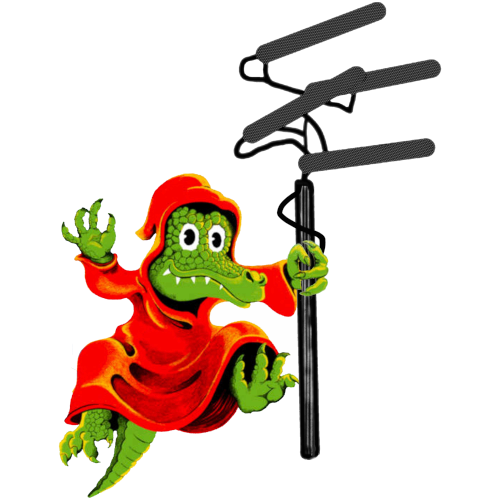

    
    <h1>Gizz Tapes 2</h1>
    

        Live music streaming web app
         
        <a href="https://tapes.kglw.net"><strong>Visit live site »</strong></a> &bull;
        <a href="https://gizztapes2-staging.fly.dev/"><strong>Visit staging site »</strong></a>
    

Uses Rails 8, Tailwind, daisyUI, Hotwire (Turbo and Stimulus) and SQLite. Currently hardcoded to cater for King Gizzard, using the Internet Archive as a backend for recordings and KGLW.net for setlist and other data. Built without AI.

## Contributing

We welcome any and all contributions! Feel free to [open an issue to report a bug or request a new feature](https://github.com/kglw-dot-net/tapes/issues), or [open a pull request](https://github.com/kglw-dot-net/tapes/pulls) to contribute directly.

When contributing code, please follow conventional commit messages, and do not submit any AI-generated pull requests. Instead, please ensure that a human has reviewed, tested, and fully understands all the code changes being submitted.
